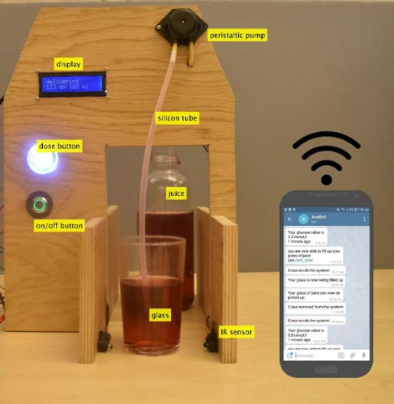
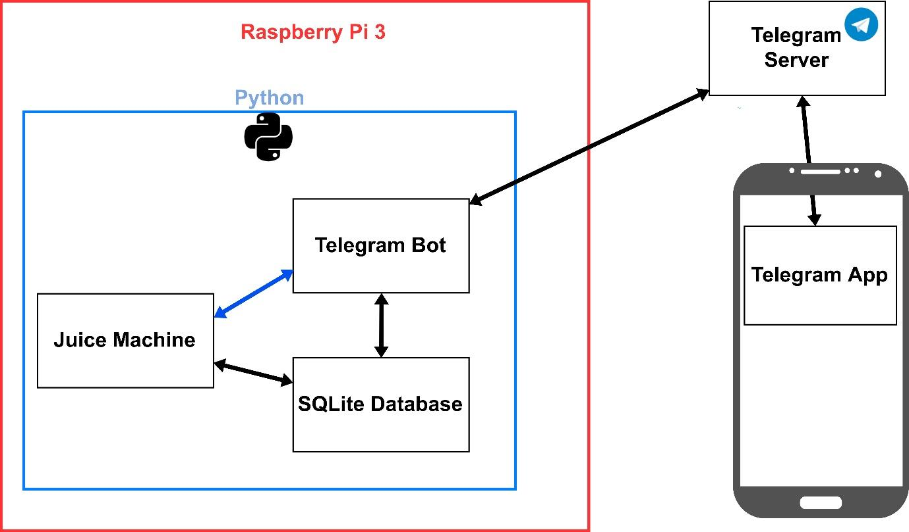
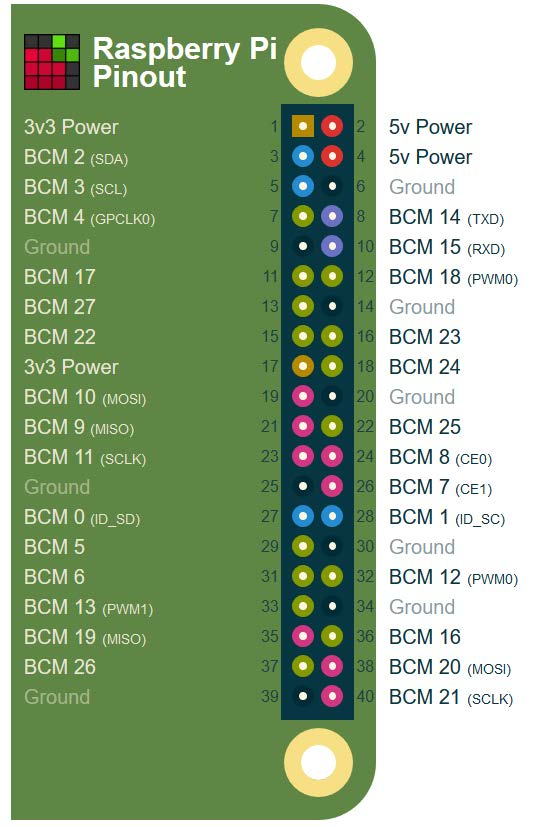
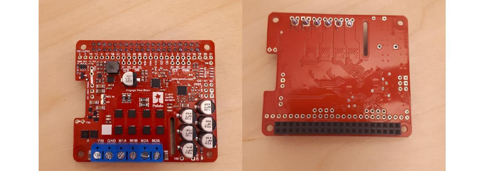
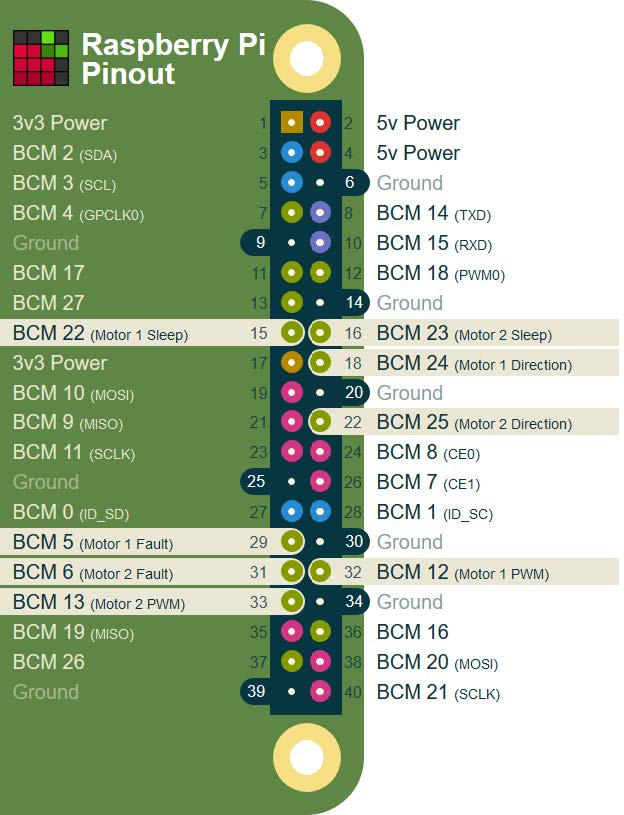
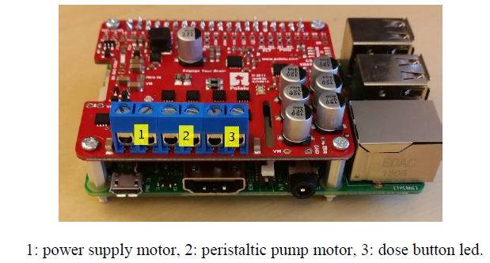
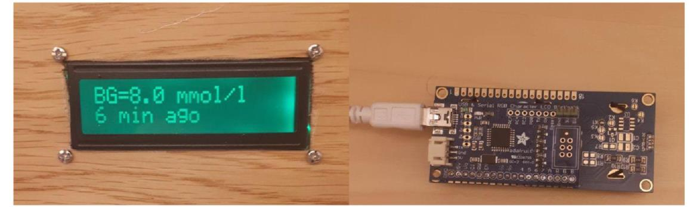
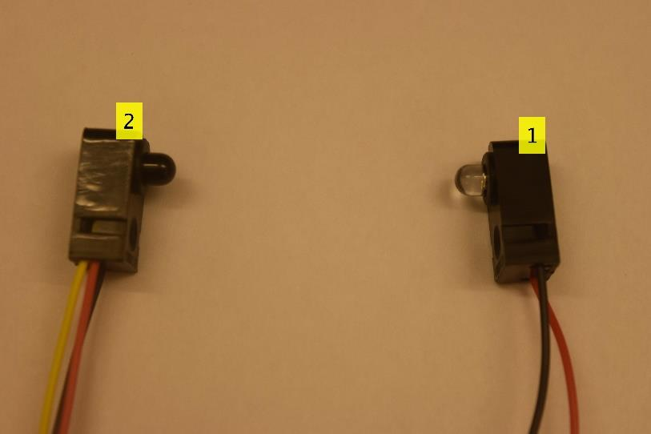
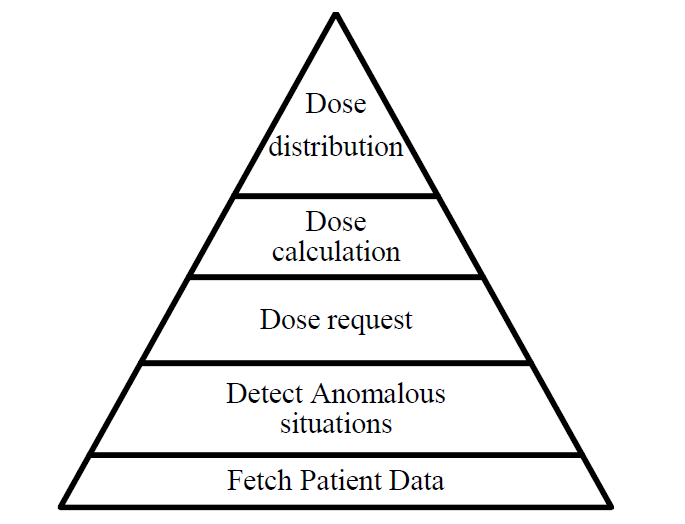

# House of Carbs

Patients with diabetes are often worried about having low blood glucose because of the unpleasant feeling and possible dangerous situations this can lead to. This can make patients consume more carbohydrates than necessary. Ad-hoc carbohydrate estimation and dosing by the patients can be unreliable and may produce unwanted periods of high blood glucose. The House of Carbs, reffered to as System ACE in the code, is a system that automatically estimates and dispenses the amount of juice (or similar) according to the current patients' blood glucose values. The system is remotely accessible and customizable from a chatbot, exploits sensors and actuators to dispense the necessary amount of liquid carbohydrates. It relies on a cloud solution (Nightscout) to acquire the patient's blood glucose values, which are constantly updated thanks to a commercial wearable continuous glucose monitor (CGM).

 

The House of Carbs was developed using Python 3. The whole system and the DBMS are inside a unique node Raspberry Pi 3 model B, a small computer, released in 2016.  
This system is a multithreading solution, where the [main thread](code/main.py) starts two separate threads: the former that controls the [Juice Machine](code/thread_machine.py), the latter that manage the [Telegram bot](Machine/thread_bot.py). A telegram bot is a third-party application that run inside Telegram, all their functionalities are hard-coded in [a Python file](code/thread_bot.py). 
These two threads communicate via Events and via a shared database. 
Regarding the main thread of Juice Machine, it controls three separate threads. Each of these threads manage and read the status of a single component of the Juice Machine: “on/off button”, “dose button”, and IR sensor.

The Telegram bot is composed by two thread also: the former is synchronous and communicates with the user, the latter is asynchronous and sends notifications to user regarding the Juice Machine status (e.g., dose ready to be picked up, glass removed). 
The synchronous thread is responsible to continuously attempting to check if there are messages sent by the Telegram server (polling mode). In order to make possible the communication between users and the Telegram bot. 
Instead, the asynchronous thread, defined as Job in the Telegram Bot API, may perform task periodically. House of Carbs uses this thread each 5 seconds to verify the status of the Juice Machine using the shared events. When a change is detected, this thread communicates any changes via a broadcast message to all the users. Users that to receive these messages must have started at least a communication with the chatbot.




# Software and Hardware Requirements

The machine is a combination of Hardware and Software

## Built With [Hardware]
DISCLAIMER: Some soldering skills are needed

* *[Raspberry PI 3]*
* *[Pololu Dual G2 High-Power Motor Driver]*
* *[Serial RGB Backlight Character LCD Backpack]*
* *[Peristaltic Pump and Silicon Tubes]*
* *[Dose Button and on/off Button]*
* *[IR Sensor]* 

### Raspberry PI 3

Integration with different electronics components: most of them are reachable via 40-pins (see figure below). These programmable pins can be accessible to manage hardware suchas sensors, motors, switches, buttons and many others.

 

As it can be seen from Figure above, the top pins on the left may provide 5 volt as external power supply. This aspect restricts the potential dosing actuators that could be connected. Taking this problem into account, an additional add-on board was used.

### Pololu Dual G2 High-Power Motor Driver

This add-on board (see figure below) allows to control two high-power DC motors with a Raspberry Pi. The driver offers basic current limiting functionality and provides an interface with a python library to Raspberry Pi’s GPIO pins. 

There are three several models providing different motors voltage: 18v18, 18v22 and 24v14 volts, all designed to be mount on and plug into Raspberry Pi with 40-pin GPIO headers.



The version selected for the first prototype is using the 18v18 version powered by an external power supply with 23 volts (see figure below)



Once you connect the Raspberry PI 3 and the Pololu Dual G2 High-Power Motor Driver, it should look as following:



### Serial RGB Backlight Character LCD Backpack
The System ACE has a character LCD display produced by Adafuit. It allows to display sixteen characters into two lines. The Raspberry Pi transmits data to the display via serial communication. This is possible thanks to the add on board soldered to the LCD display (see figure below)



To enhances the differences among the CGM values, System ACE uses the RGB backlight and Brightness regulation.

The display colour changes according to the glucose value:
* RED with the corresponding RGB triple (255,0,0) refers to hypoglycemia.
* GREEN with the corresponding RGB triple (0, 255, 0) refers to glucose value in range.
* PURPLE with the corresponding RGB triple (75,0,130) refers to hyperglycemia.

Regarding the brightness, it changes based on the age of data. Brightness levels aims empathizing the differences between recent and older CGM data.

### Peristaltic Pump and Silicon Tubes
The actuator used to pump the juice from the reservoir into a glass is peristaltic pump

The peristaltic currently in use is DC geared down motor of 12V and it is attached to the first motor of the board. Its activation occurs in two cases:
* A dose distribution is ingoing.
* User remotely ask to clear the pump.

The main characteristics of the selected pump are: flow rate of approximately 100 mL/min and a tube size with the inner and outer diameter of 2.5mm and 4.7 respectively. But you can use your own one, within the power consumption of the Pololu Dual G2 High-Power Motor Driver board.

### Dose Button and on/off Button
The “dose button” is a push button having an integrated LED with a supply voltage of 5V. Instead the “on/off button” is push button switches with a LED ring (3.3V and 6V).
They are both designed for momentary-contact applications, but the pushbutton switch alternates between two states NO (normally open) and NC (normally closed)
Instead the push button remains in a neutral state while it is not pressed vice versa it is active when pressed.
We have used the following [On/Off button](https://www.adafruit.com/product/482), [dose button button](https://www.adafruit.com/product/3491)

These two “buttons” are analysed together because they have a common feature for which they stand out among other alternatives. Both includes a LED with a built-in resistor, so no other resistors are necessary to draw the current (with low voltages). Thus, no other operation is required rather than connecting them to the board, hence avoid increasing the hardware complexity.

After presenting the difference between these components, the next aspect to be clarified is how the System ACE provides autonomous power supply.

The “dose button” LED is connected to the second motor. And the motor is activated only during the two following cases:
* The patient may request a dose
* During the distribution in which the LED is blinking every two seconds

The “on/off button” LED is connected to GPIO pin BCM 14, that provides 3.3 Volt. *Activating the UART protocol* (Universal Asynchronous Receiver/Transmitter) in the Raspberry PI. In according to the protocol, pins BCM 14 and 15 can transmit and receive data. Additionally, the pin BCM 14 starts to provide 3.3 volts until the Raspberry Pi is turned on.

### IR Breakbeam Sensors
The IR sensors is a low power and cost device, that can provide a rough, yet useful, information about the presence of the glass inside the system. Infrared (IR) break-beam sensor (see figure below)  is selected to perform the glass detection. 



The low cost, fast response time (2ms or less) the easy connection to the pull-up resistor integrated inside the GPIO pins were the main reasons to select this component.
Both the emitter and the receiver must be supplied with power. In System ACE, the display add-on board provides 3.3 volts to the emitter and 5 volts to the receiver.
According to the producer description, a lower voltage produces a weak beam. A weak beam enables the detection of the glass some limitations.

## Built With [Software]

* [Nightscout](http://www.nightscout.info/) - Source of the CGM data
* [Raspberry Pi OS](https://maven.apache.org/) - Operating System
* [Python3](https://www.raspberrypi.org/documentation/linux/software/python.md) - Programming Language used

## How the machine works

The hierarchical structure of the product functionality is represented through a pyramidal structure. Each functionality will be described in detail, starting from the widest section to the narrowest one.



### Fetch patient data
This functionality should allow the system to retrieve real-time patient data. The original BG data from the Nightscout platform require a pre-processing phase before been analysed. 
Set of data provided by Nightscout can be different from patient to patient.
However, data used from this project are restricted (see the table below). How and which data are used, it will be described into the next product functionality. 

|Name |Description|Used|
| --- | --- | --- |
|SGV (sensor glucose values)|Blood glucose levels is in terms of a molar concentration, measured in mmol/L or mg/dL| yes|
|SGV timestamp|Unix Timestamp15 data CGM data has been recorded. |yes|
|Trend|Numeric value that indicates the trend direction. (see Table below for the correspondence between trends and direction).|no|
|Direction|An arrow or two that indicate the trend of glucose values.|yes|
|BG delta|Difference between the current SGV and the previous one.|no|
|Insulin on Board (IoB)|Estimation of insulin active in the body|no|
|Carbohydrates on Board (CoB)|Estimation of carbohydrates that must be process by the body|no|
|Battery|Percentage off battery of the CGM devices|no|

|Trend |Direction|Symbol Nightscout|
| --- | --- | --- |
|1|DoubleUp|↑↑|
|2|SingleUp|↑|
|3|FortyFiveUp|↗|
|4|Flat|→|
|5|FortyFiveDown|↘|
|6|SingleDown|↓|
|7|DoubleDown|↓↓|
|8|NOT COMPUTABLE|−|

### Detect Anomalous Situation
Various scenarios may be verified based on sensor glucose value. Some values lead to potential anomalous situations others not. This product functionality is responsible to recognize all the potential anomalous situation for patients.  
Before performing their analysis, CGM data should be “recent”. 
In this system, the term “recent” is not older than 15 minutes

#### How to Detect Hypoglycemia
The default threshold used for considering a blood glucose value as a possible hypoglycemia is equal to 3.9 mmol/L (70 mg/dL).
To detect an hypoglycemia is necessary to verify if the patient is under treatment, patients are considered under treatment if the dose received is still effective, a dose is still effective when both conditions are verified:
* The elapsed time between the last CGM value received and the last dose received is higher than 15 minutes.
* The direction of the last CGM data does not report any rise.

#### How to Detect Hyperglycemia
This system is not designed for the treatment of hyperglycemia since its treatment consists of an insulin injection. However, patient should be at least advised when the hyperglycemia is ingoing. Detecting hyperglycemia is verified when the glucose value overcome 10 mmol/L (180 mg/dL). This value is common threshold for hyperglycemia detection and will be used as default threshold by the system, nevertheless user should be able to modify it. 

#### Dose request
The system is designed to make patients able to request a dose. This is done through a special threshold defined as investigate threshold. Patients may request a dose when the glucose value is recent and inside the defined interval with limitation of not being under treatment. 
This functionality is useful for patients when they need extra carbohydrates before an intense activity (e.g., physical activity) (Seaquist et al., 2013) or for safety reason before activities that may be risky (e.g., driving, working) (Bailey et al., 2016). 

#### Dose calculation 
This functionality accomplishes the dose calculation. When an hypoglycemia is detected, the dose is equal to 20 grams, concerning the requested dose can be equal to 15, 20 grams or an individual quantity.
As example, With a Fruit Juice with 9,1g of carbohydrates on 100ml and a dose of 15g, then the dose amount is equal to (15g*100ml)/9,1g = 164 ml

#### Dose Distribution
This functionality should allow the system to release the amount juice defined during the dose calculation. 
Additionally, this product functionality has to consider the fact that the peristaltic pump does not produce any signal error. It will not possible to detect any error during the juice distribution using the peristaltic pump. 
An error that may occur is that the peristaltic pump cannot extract the juice from its container. 
The reasons for this error can be that either the container can be empty, or the amount left on the container is lower than the amount required for the dose. This limitation of the peristaltic pump should be addressed by this product functionality. 
As well this functionality must verify the glass presence during the distribution. Otherwise the juice distributed can be lost. Moreover, the dose must be stored only once user has picked up the glass. Or be blocked, in case which user has forgotten the previous dose. 

## How to run the code

### Installing operating system in the Raspberry PI 3
The first step is to install the OS in the SD card for the Raspberry PI 3, follow the original instructions at this [link](https://www.raspberrypi.org/documentation/installation/installing-images/)

### Installing the Pololu Dual G2 High-Power Motor Driver
Now we can install the drivers, we have to install the drivers for the motor board, the following instraction are based on [this repository](https://github.com/pololu/dual-g2-high-power-motor-driver-rpi)

Download and install pigpio and its Python 3 module, run:

```
sudo apt install python3-pigpio

```
Then, to start the pigpiod daemon that it will run every time your Raspberry Pi boots
```
sudo systemctl enable pigpiod
```

Finally, to download and install the dual_g2_hpmd_rpi library, run:
```
git clone https://github.com/pololu/dual-g2-high-power-motor-driver-rpi
cd dual-g2-high-power-motor-driver-rpi
sudo python3 setup.py install
```
Test it, navigate to the dual-g2-high-power-motor-driver-rpi directory and run:
```
python example.py
```
Now you can attach the Pololu Dual G2 High-Power Motor Driver to the Raspberry PI 3 and connect all the components to it.

### Activating the UART protocol 

Start raspi-config
```
sudo raspi-config.
```
And performs the following operations
* Select option 5 - interfacing options.
* Select option P6 - serial.
* At the prompt Would you like a login shell to be accessible over serial? answer 'No'
* At the prompt Would you like the serial port hardware to be enabled? answer 'Yes'
* Exit raspi-config and reboot the Pi for changes to take effect
```
sudo shutdown -a now
```

### Create a BOT via telegram
* install telegram in your personal devices https://telegram.org/
* contact the BotFather https://telegram.me/BotFather
* use the command /newbot
* chose a name for your bot

### Add the token of your Bot to the code
* use the command /token in the BotFather
* select the Bot that you have created
* copy the token access HTTP API received (e.g., 56481254:ASDHrjhgjhg)
* paste this token in line 13 of [this file](code/main.py) (e.g., TOKEN=56481254:ASDHrjhgjhg)

### Run House carbs
Now you can the start the code.
```
cd house-of-carbs
sudo python3 code/main.py
```
If you want to start automatically the code
``` 
sudo crontab -e
```
Add the following line at the end of the file, the path where you saved the file may be different.
```
@reboot sudo /usr/bin/python3 home/pi/huse-of-carbs/code/main.py
```

## Authors

* **Pietro Randine** - *Designer and Developer*


## License

This project is open-source

## References

TOMKY, D. J. D. S. 2005. Detection, prevention, and treatment of hypoglycemia in the hospital. 18, 39-44.

KREIDER, K. E., PADILLA, B. I. & PEREIRA, K. J. T. J. F. N. P. 2017. Hypoglycemia in diabetes: challenges and opportunities in care. 13, 228-234.

SEAQUIST, E. R., ANDERSON, J., CHILDS, B., CRYER, P., DAGOGO-JACK, S., FISH,L., HELLER, S. R., RODRIGUEZ, H., ROSENZWEIG, J. & VIGERSKY, R. J. D. C. 2013. Hypoglycemia and diabetes: a report of a workgroup of the American Diabetes Association and the Endocrine Society. DC_122480.

BAILEY, T. S., GRUNBERGER, G., BODE, B. W., HANDELSMAN, Y., HIRSCH, I. B.,JOVANOVIČ, L., ROBERTS, V. L., RODBARD, D., TAMBORLANE, W. V. & WALSH, J. J. E. P. 2016. American Association of Clinical Endocrinologists and American College of Endocrinology 2016 outpatient glucose monitoring consensus statement. 22, 231-261.

